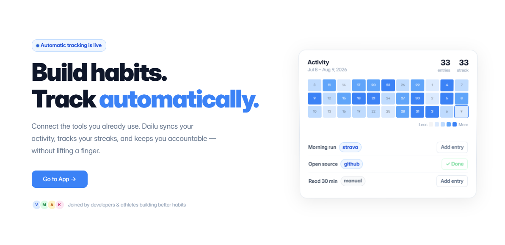
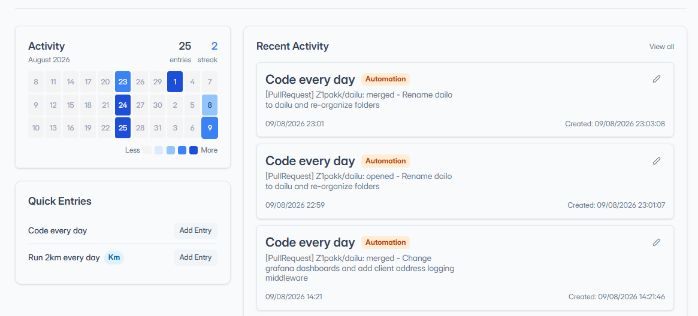
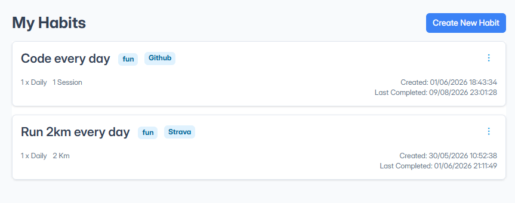
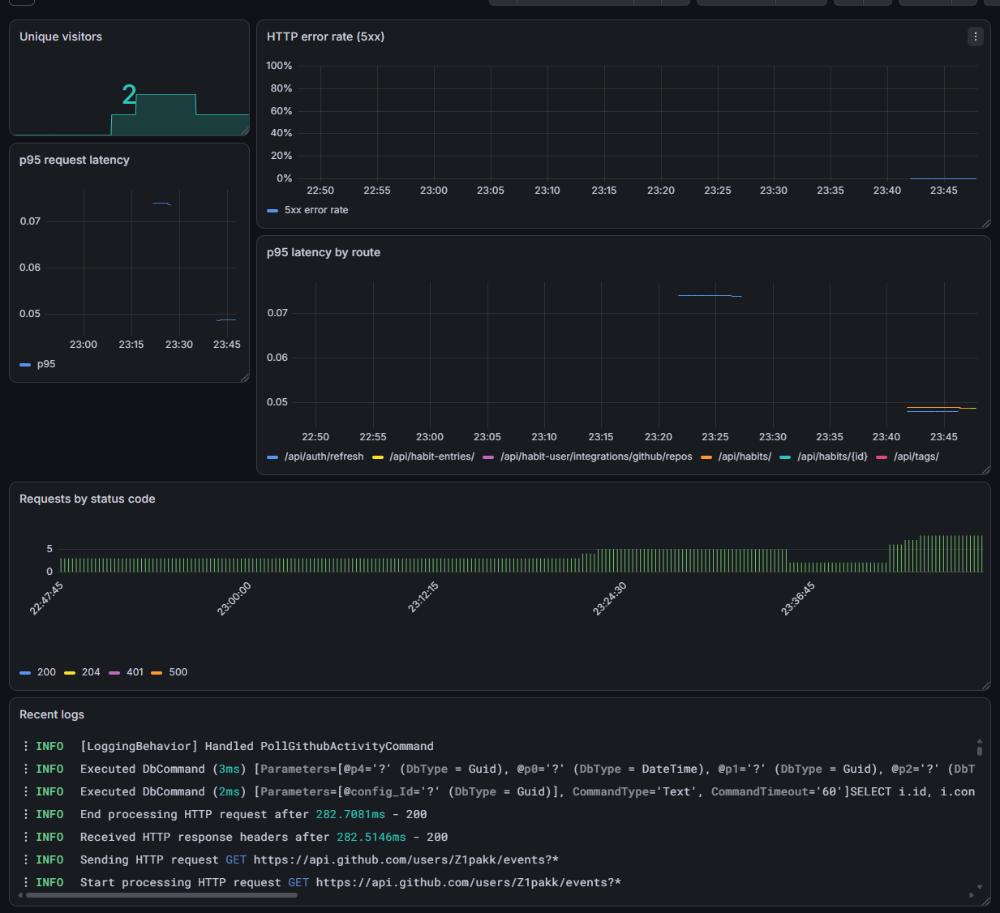
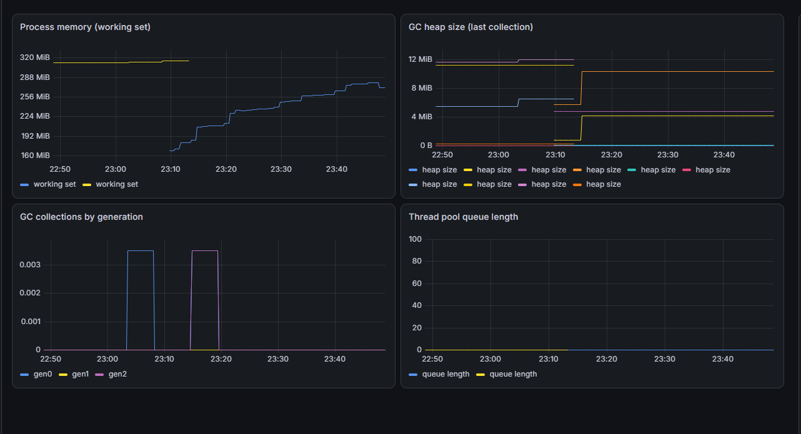

# Dailu


**Live at [dailu.dev](https://dailu.dev)**

Dailu is a habit tracker I built because checkbox apps never stuck for me — I'd forget to open them. Habits here can log themselves: connect Strava, GitHub, or Google Health and a matching activity fills in today's entry without you touching the app.

This is a study project — I used it to actually practice a modular monolith in .NET, CQRS, EF Core, and a modern Angular setup, rather than just reading about them. It's part of my portfolio, so expect the odd rough edge alongside things I cared enough about to get right.

## What it does

- **Two kinds of habits** — binary ones you just check off ("meditated today") and measurable ones with a target ("run 20km this week")
- **Daily, weekly, or monthly frequency**, each with its own target and milestones
- **Automatic logging** through Strava, GitHub, or Google Health — a run, a commit, or a workout can complete a habit on its own
- **Tags** to group and filter habits
- **A heatmap view** of your history, in the same spirit as GitHub's contribution graph
- **JWT-based auth**, one account per user

## How it's built

It's a modular monolith — one deployable API, but the code underneath is split into independent vertical slices, one per domain: `Habit`, `HabitEntry`, `HabitUser`, `Tag`, `Identity`. Each slice has its own domain, application, infrastructure, and API layer, and its own EF Core `DbContext`. They only talk to each other through explicit integration contracts, so a slice could be pulled out into its own service later without a rewrite — that's the whole point of doing it this way instead of one tangled project.

**Backend** — .NET 10, ASP.NET Core minimal APIs, EF Core + PostgreSQL, a source-generated CQRS mediator (not MediatR), FluentValidation, JWT auth via ASP.NET Core Identity, OpenAPI docs through Scalar. Orchestrated locally with .NET Aspire.

**Frontend** — Angular 21, built with signals rather than the old decorator APIs, NGXS for state, PrimeNG + Tailwind for UI, Valibot for validation.

**Observability** — OpenTelemetry traces, metrics, and logs flow through an OTel Collector into Prometheus, Loki, and Tempo, with Grafana on top to actually look at any of it.

## CI/CD & deployment

The build badge up top isn't decorative — there's an actual pipeline behind it. GitHub Actions builds and tests every PR, and a push to `main` builds Docker images, runs EF Core migrations, and deploys to a real production environment: a Hetzner VPS running [Dokploy](https://dokploy.com/). Migrations run over SSH secured with short-lived certificates from a self-hosted `step-ca`, reached over Tailscale — no standing VPN keys or long-lived server credentials sitting in secrets.

## Running it locally

```bash
# Backend + Postgres — Aspire brings the database up for you
cd Dailu/src/aspire/Dailu.AppHost && dotnet run

# Frontend
cd Dailu/src/frontend/Dailu.ClientApp && npm install && npm start

# Observability stack (optional)
cd Dailu/observability && docker compose up
```

## Project layout

The modular-monolith split from above, as actual folders — each module under `modules/` is a self-contained vertical slice:

```
Dailu/
  src/
    modules/           habit, habit-entry, habit-user, tag, identity — each its own
                        domain / application / infrastructure / api slice
    api/Dailu.Api/      composition root — wires every module together
    aspire/             local orchestration (Aspire AppHost)
    frontend/           Angular SPA
    shared/             cross-cutting kernel + shared infrastructure
    tests/              architecture tests + shared test helpers
  observability/         OTel Collector, Prometheus, Loki, Tempo, Grafana
```

*Landing page.* <br />


*Dashboard overview.*<br />


*Logging an entry.*<br />


*Grafana — service overview.*<br />


*Grafana — .NET runtime metrics.*<br />

